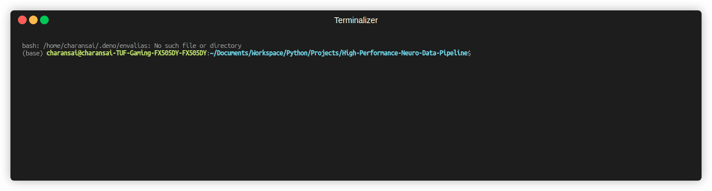

# NeuroAlign

[](https://www.python.org/downloads/)
[](https://opensource.org/licenses/MIT)
[](https://badge.fury.io/py/neuro-align)

NeuroAlign is a zero-copy Python pipeline that mathematically synchronizes out-of-core Neuropixels (30kHz), BIDS fMRI, and behavioral video (60 FPS) without exceeding standard RAM limits. It exports the synchronized data directly to PyTorch-ready HDF5 formats.

**Input:** Massive `.dat`, `.nii.gz`, and `.mp4` files  
**Processing:** Zero-copy memory mapping (`mmap`), temporal index alignment, and dynamic string filtering  
**Output:** Synchronized `.h5` file ready for deep learning ingestion

  
*Example: NeuroAlign filtering and mathematically synchronizing three modalities in milliseconds.*

---

## The Problem: The RAM Bottleneck

As neuroscience datasets scale to the terabyte level (for example, the Allen Brain Observatory or Brain Wide Map), standard procedural data loaders act as severe bottlenecks.

Attempting to load a 100GB Neuropixels `.dat` file using standard tools like `numpy.fromfile()` will force the OS to page to disk, ultimately crashing the pipeline with a `MemoryError`. Furthermore, researchers are forced to write custom, slow Python loops to align high-frequency probes (30,000 Hz) with low-frequency behavioral video (60 FPS) and sparse BIDS fMRI scans.

---

## The Solution: Out-of-Core Architecture

NeuroAlign solves this by bypassing standard memory allocation entirely.

- **Zero-Copy Loading**  
  Utilizes OS-level memory mapping (`numpy.memmap`) for binary files and `nibabel` proxy objects for NIfTI formats, enabling instant partial access to multi-gigabyte arrays.

- **BIDS-Aware Parsing**  
  Automatically parses JSON sidecars for Repetition Times (TR) and safely handles sparse acquisition paradigms.

- **Dynamic String Filtering**  
  Uses object composition to parse conditional string rules (such as `"signal > 0.8"`) directly onto out-of-core arrays, dropping irrelevant data before synchronization.

---

## Proof of Performance

| Method                  | Dataset Size | RAM Consumed | Time to Slice & Align | Status     |
|------------------------|-------------|--------------|----------------------|------------|
| Standard `np.load()`   | 50 GB       | > 50 GB      | N/A                  | OOM Crash  |
| **NeuroAlign (mmap)**  | **50 GB**   | **~50 MB**   | **< 200 ms**         | **Success** |

*Benchmarks were run on standard consumer hardware featuring 16GB RAM and a standard NVMe SSD.*

---

## Why Use NeuroAlign vs. Existing Tools?

- **Standard NumPy/Pandas**  
  Standard libraries are built for in-memory operations. NeuroAlign is explicitly engineered for out-of-core, larger-than-RAM data.

- **Generic ML Pipelines**  
  Generic tools do not understand neuro-specific metadata. NeuroAlign natively speaks the BIDS standard and inherently handles the complex floating-point math required to synchronize 30kHz neural spikes with 60Hz camera frames.

---

## Quickstart and Installation

Install NeuroAlign globally via pip:

```bash
pip install neuro-align
```

Alternatively, clone this repository and run:

```bash
pip install -e .
```

for the latest development version.

---

## Command Line Interface

Installing the package exposes the `neuro-align` global command. You can align any combination of Electrophysiology, Video, and fMRI data.

### Standard Alignment with Export

```bash
neuro-align \
  --ephys neuropixels.dat \
  --video behavior.mp4 \
  --fmri sub-01_bold.nii.gz \
  --time 2.5
```

### Applying Memory-Saving Filters

Isolate specific signals during initialization to drop low-value data from RAM early:

```bash
neuro-align \
  --ephys neuropixels.dat \
  --video behavior.mp4 \
  --time 2.5 \
  --filter "signal > 0.8"
```

---

## Running the Test Suite

NeuroAlign enforces strict validation for its synchronization mathematics and temporal alignments. To run the automated tests locally:

```bash
git clone https://github.com/BitForge95/High-Performance-Neuro-Data-Pipeline.git
cd High-Performance-Neuro-Data-Pipeline
pip install pytest
pytest tests/
```

---

## Contributing

This project was initially developed as an architectural exploration for the Experanto ecosystem under the INCF. Contributions, issues, and feature requests are highly welcome.

---

## License

Distributed under the MIT License. See the `LICENSE` file for more information.